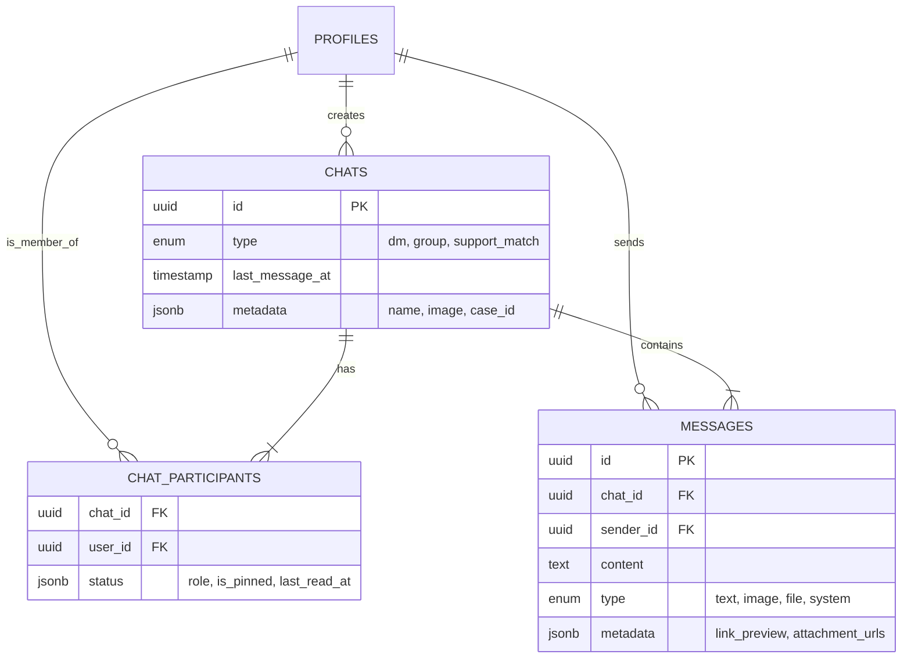

# Chat Functionality Documentation

## TL;DR

The Sauti Salama Chat System is a **real-time, secure messaging platform** built directly on top of the application's database (Supabase). It supports **Direct Messages (DMs)**, **Group Chats** (extensible), and **Contextual Chats** (linked to cases/appointments). Key features include real-time updates, file connections, link previews, and a dedicated AI Assistant ("Salama AI"). The system is designed for privacy with strict Row Level Security (RLS) policies.

---

## 1. Overview

The chat module provides a seamless communication channel for users (Survivors, Counselors, System Administrators) to interact. Unlike third-party chat services, this custom implementation keeps all data within the platform's secure boundary, ensuring compliance and data sovereignty.

### core Philosophy

- **Security First**: Access is controlled strictly via RLS.
- **Real-Time**: Messages are delivered instantly using Supabase Realtime/WebSockets.
- **Context Aware**: Chats can be linked to specific entities like **Medical Cases** or **Appointments**.
- **User Centric**: Includes typing indicators (UI), optimistic updates, and rich media support.

---

## 2. Participants & Users

The system supports multiple types of participants interacting in the same ecosystem.

| Participant Type      | Description                                                                |
| :-------------------- | :------------------------------------------------------------------------- |
| **Survivors / Users** | Standard users seeking support or communicating with professionals.        |
| **Counselors / Pros** | Verified professionals providing support.                                  |
| **System / AI Bot**   | Automated participants (e.g., "Salama AI") for triage and instant support. |
| **Admins**            | Users with elevated privileges (can moderate group chats).                 |

### Relationship Model

- **One-to-One (DM)**: Two participants.
- **Group Chat**: Multiple participants (future-ready structure).
- **Support Match**: Contextual chat between a survivor and a matched professional.

---

## 3. Features

### ✅ Current Functionality

- **Real-time Messaging**: Instant text delivery.
- **Rich Media**: Support for file uploads (documents, images).
- **Link Previews**: Automatic extraction of metadata (title, image, description) from shared URLs.
- **Chat Listing**: Sidebar with search, filtering (All/Unread/Groups), and unread count badges.
- **Typing Indicators**: Visual cues when the other party is typing (UI stub/local state).
- **AI Assistant**: Specialized integration with "Salama AI" for automated onboarding and capability queries.
- **Context Banners**: Visual headers linking a chat to a specific **Case File** or **Appointment**.

### 🔄 Planned / Future Features

- **Read Receipts**: Tracking who has read a message and when.
- **Voice & Video Calls**: Future integration options (webrtc).
- **Message Reactions**: Emojis/reactions to specific messages.
- **Forwarding**: Ability to forward messages to other chats.

---

## 4. Database Structure & Architecture

The chat system is built on a robust SQL schema optimized for performance and security.

### 4.1. Entity Relationship Diagram (ERD)

### 4.2. Key Tables Breakdown

#### `public.chats`

The root entity.

- **`type`**: Distinguishes between `dm`, `group`, etc.
- **`last_message_at`**: Critical for sorting the chat list efficiently.
- **`metadata`**: Flexible JSONB field to store contextual data (e.g., `appointment_id`, `case_id`, `active_call_url`).

#### `public.chat_participants`

The join table linking Users to Chats.

- **`status`**: Stores user-specific settings per chat.
  - `last_read_at`: Used to calculate unread counts.
  - `is_muted`: Allows users to silence specific chats.

#### `public.messages`

The individual atomic units of communication.

- **`type`**: `text` (default), or rich media types.
- **`metadata`**: Stores rich content data.
  - _Example Link Preview DB Data_: `{"link_preview": {"title": "Google", "image": "..."}}`

---

## 5. User Flows & Scenarios

### Scenario A: Starting a Chat (Direct Message)

1. **User A** clicks "Message" on **User B's** profile.
2. **System** checks `chat_participants` for an existing `dm` chat between User A and User B.
   - _If exists_: Redirects to that `chat_id`.
   - _If fully new_: Creates a new row in `chats`, adds both users to `chat_participants`.

### Scenario B: Sending a File

1. **User** selects a file (e.g., specific PDF report).
2. **Client** uploads file to Supabase Storage bucket `chat-media`.
3. **Client** receives public URL.
4. **Client** sends a message of type `file` with `metadata: { attachment_urls: [url] }`.
5. **Recipient** sees a downloadable file attachment bubble.

### Scenario C: Contextual Awareness (Case Management)

1. **Counselor** views a **Case File**.
2. **Counselor** clicks "Discuss with Supervisor".
3. **System** creates a chat with `metadata: { case_id: "123" }`.
4. **Chat Window** detects `case_id` in metadata and renders a **Blue Banner** at the top: _"📂 Case File - Review case details"_.
5. **Action**: Clicking the banner navigates directly to the Case details page.

---

## 6. Media Types Support

The system is designed to be content-agnostic via the `message_type` enum.

| Type       | How it renders                                  | Metadata Structure                            |
| :--------- | :---------------------------------------------- | :-------------------------------------------- |
| **Text**   | Standard bubble. Auto-links URLs.               | `{}`                                          |
| **Image**  | In-bubble image preview with lightbox on click. | `{ "width": 800, "height": 600 }`             |
| **File**   | Icon + Filename + Download Button.              | `{ "filename": "report.pdf", "size": "2MB" }` |
| **System** | Centered gray text (e.g., "User left group").   | `{ "action": "leave" }`                       |
| **Link**   | Text + Rich card attachment.                    | `{ "link_preview": { ... } }`                 |

---

## 7. Security & Policies

Security is enforced at the database layer (Supabase RLS), meaning **backend APIs cannot be bypassed** to access unauthorized chats.

- **View Chat**: You must be present in the `chat_participants` table for that `chat_id`.
- **Read Messages**: You must be a participant of the chat the message belongs to.
- **Send Message**: You must be a participant of the target chat.

---

## 8. Recommendations & Future Improvements

### 🚀 Performance

1. **Pagination**: Currently messages load in batches. Ensure "infinite scroll" is robust for chats with 10k+ messages.
2. **Optimistic Updates**: Ensure the UI updates _immediately_ when sending, reverting only if the server fails. This is partially implemented but can be refined for file uploads.

### 🛡️ Security

1. **Virus Scanning**: Implement a server-side function to scan uploaded files in the `chat-media` bucket before they are downloadable.
2. **Rate Limiting**: Prevent abuse by limiting how many messages a user can send per minute via Database Functions or Edge Functions.

### 🧩 Functionality

1. **"Deleted" Status**: Implement soft-delete for messages (update `deleted_at` instead of removing row).
2. **Presence**: Use Supabase Presence to show "Online" / "Last Seen" status in the sidebar.
