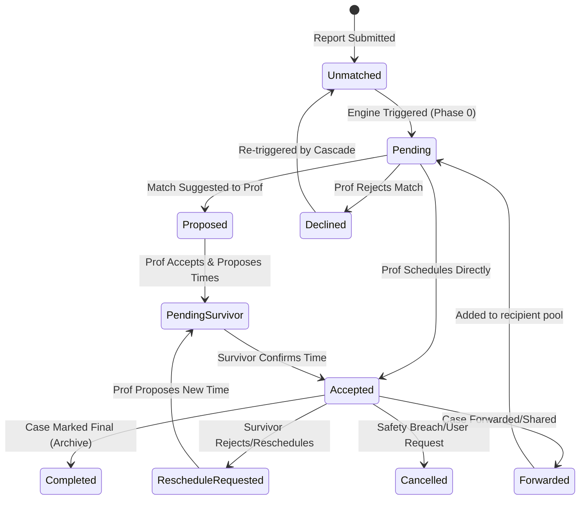

# Sauti Salama: Matching Algorithm & Coordination Protocol
**Version:** 2.6 (Conclusive Truth)  
**Status:** Unified System Specification  
**Last Updated:** April 2026

## 1. Actor Taxonomy
The matching engine coordinates interactions between four primary entities:

- **Survivor (User):** The initiator of a report. Can be a self-reporter, a child (via specialized protection logic), or an anonymous reporter.
- **Support Service (Provider):** A verified organization or clinic offering specific clinical specialties (Medical, Legal, Mental Health, etc.).
- **HRD / Professional (Individual):** A verified individual responder (Lawyer, Doctor, Human Rights Defender) who can handle cases directly or on behalf of a service.
- **Service Pool (Delegation):** A collective queue where cases are forwarded when a direct match is unavailable or specialized triage is required.

---

## 2. Global Matching Strategy: "Human-Centric Precision"
Sauti Salama utilizes a **Multi-Stage Weighted Scoring Cascade**. Unlike simple search, the engine optimizes for:
1. **Clinical Relevance:** Ensuring the victim gets the *right* type of help.
2. **Proximity & Access:** Minimizing physical barriers to support.
3. **Professional Authority:** Prioritizing responders with legal or medical standing for high-risk incidents.
4. **Load Balancing:** Preventing responder burnout by distributing case volume.
5. **Temporal Urgency:** Accelerating the matching speed as a report age increases.

---

## 3. The Coordination Lifecycle
A match moves through a strictly defined state machine to ensure zero "dead cases":

---

## 4. The Data Model (High-Level)
| Field | Type | Description |
| :--- | :--- | :--- |
| `report_id` | UUID | Foreign Key to the incident report. |
| `service_id` | UUID | (Optional) Link to a Support Service organization. |
| `hrd_profile_id` | UUID | (Optional) Link to an individual Professional profile. |
| `match_score` | Integer | The final calculated score (0-100+). |
| `match_status_type` | Enum | {pending, proposed, accepted, declined, completed, cancelled, reschedule_requested, pending_survivor}. |
| `cascade_level` | Integer | Tracking which phase of the temporal cascade generated this match. |
| `is_fallback_match`| Boolean | True if the match was selected via the fallback threshold (-50). |
| `escalation_required`| Boolean | True for child cases or high-risk incidents. |

---

## 5. Security & Privacy Gates (Privacy Shield)
The engine enforces a strictly gated protocol to protect survivor PII:
- **Phase 0 (Privacy Mode):** Professional sees **only** the incident type, urgency, and generalized location. Survivor identity is hashed/hidden.
- **Phase 1 (Finalized):** Once an appointment is scheduled/confirmed, the "Privacy Shield" is lifted. Secure end-to-end encrypted chat is initialized, and PII (Name, Phone) is revealed.

---

## 6. The 10-Stage Scoring Algorithm
The engine runs the following pipeline for every candidate in the pool:

### Stage 1: Candidate Aggregation
Building the pool of verified professionals and services. (Filtering out unverified accounts).

### Stage 2: Hard Filters (Elimination)
Candidates are instantly disqualified (-∞ score) if:
- **Legal Consent:** Report withheld legal consent and responder is a Lawyer (unless minor).
- **Service Relevance:** Zero overlap between report `incident_type` and responder `service_capabilities`.
- **Capacity:** Responder has **5+ truly active cases**.
- **Geographic Boundary:** Distance exceeds `radius * 2.5` (Std) or `radius * 4.0` (Relaxed).

### Stage 3: Clinical Specialty Scoring
- **Primary Match:** +25 pts (High-fidelity specialty alignment).
- **Secondary Match:** +15 pts.
- **Requested By Name:** +20 pts (Stackable bonus).

### Stage 4: Proximity Scoring
- **Remote Service:** +15 pts (Flat bonus).
- **In-Person Proximity:** `MAX(0, 20 * (1 - distance/radius))`.
- **Temporal Relaxation:** +5 pts (If report is >24hrs old).
- **Outside Area Penalty:** -10 pts.

### Stage 5: Professional Authority Matrix
Weighting based on Title vs. Incident Type (e.g., Doctor for Sexual Abuse = +10, Lawyer for Financial = +10). See Authority Matrix in `lib/matching-engine/constants.ts`.

### Stage 6: Availability Alignment
Matches urgency against the responder's availability profile:
- **24/7 Profile:** +10 (High), +8 (Medium), +5 (Low).
- **Flexible Profile:** +7 (High), +8 (Medium), +8 (Low).

### Stage 7: Demographic & Special Needs
- **Language Match:** +15 pts.
- **Gender Match:** +10 pts.
- **Disability Specialist:** +15 pts.
- **Queer Support Specialist:** +15 pts.
- **Child Case Penalty:** -50 pts (For non-specialists handling minors).

### Stage 8: Load Balancing
- **0 Active Cases:** +30 pts (Incentivizing idle responders).
- **1 Active Case:** -8 pts.
- **2 Active Cases:** -16 pts.
- **3 Active Cases:** -24 pts.
- **4 Active Cases:** -40 pts.

### Stage 9: Urgency Multiplier
Raw total is multiplied to accelerate high-priority incidents:
- **High:** 1.2x
- **Medium:** 1.1x
- **Low:** 1.0x

### Stage 10: Final Selection
1. **Primary Selection:** Filter score ≥ 10. Select Top 5.
2. **Fallback Selection:** If Primary is empty, filter score > -50. Select Top 3 (Flagged as `is_fallback`).
3. **Manual Review:** If Fallback is empty, report is flagged for `requires_manual_review`.

---

## 7. The Temporal Cascade Protocol
If a report is not accepted within specific timeframes, the engine escalates by relaxing geo-filters and expanding the pool.

| Phase | Threshold (Std) | Threshold (High) | Logic Change |
| :--- | :--- | :--- | :--- |
| **1: Nudge** | 20 Minutes | 10 Minutes | Re-send push notifications to Top 3 candidates. |
| **2: Extended** | 40 Minutes | 20 Minutes | Expand search radius to `radius * 4`. Re-run engine. |
| **3: Open Pool**| 12 Hours | 6 Hours | Remove geographic restrictions (National scope). |
| **4: HRD Relay**| 18 Hours | 9 Hours | Dispatch task to relevant Human Rights Defenders. |
| **5: Admin** | 24 Hours | 12 Hours | Critical escalation to Sauti Salama administrators. |

---

## 8. Professional Engagement: The "Accept & Schedule" Flow
To prevent race conditions, the engine utilizes an **atomic server action** for acceptance:
- **Atomic Locking:** Professional selects an appointment time to instantly flip status to `accepted`.
- **Exclusivity:** All other `pending` matches for the report are automatically declined with `reason: "Taken by others"`.
- **Chat Bridge:** Supabase Realtime initializes the chat and yields the "Privacy Shield".

---

## 9. Recursive Matching (Reverse Flow)
When a professional becomes available (clears their queue), the engine runs "Reverse Matching":
- Identifies unmatched reports in the proximity.
- Dispatches "New Case Available" notifications to the idle professional.

---

## 10. Case Forwarding & Collaborative Coordination
Professionals can delegate cases when specialized care or local presence is required:
- **Forwarding:** Transferring a case directly to another verified professional via `case_shares`.
- **Triage:** Preserves milestones, private notes (if shared), and support history for the recipient.

---

## 11. Case Recommendations & Resource Linking
Responders can provide survivors with non-interactive support via **Tailored Recommendations**:
- Linking to legal documents, medical clinics, or shelters via `case_recommendations`.
- Accessible even if chat is not yet active or the professional is pending.

---

## 12. Conclusion: Zero Dead Cases
The algorithm's primary KPI is **"Time to First Professional Response"**. Through the temporal cascade and the load-balancing multipliers, Sauti Salama ensures that no survivor is left without a professional point of contact for longer than 24 hours.
